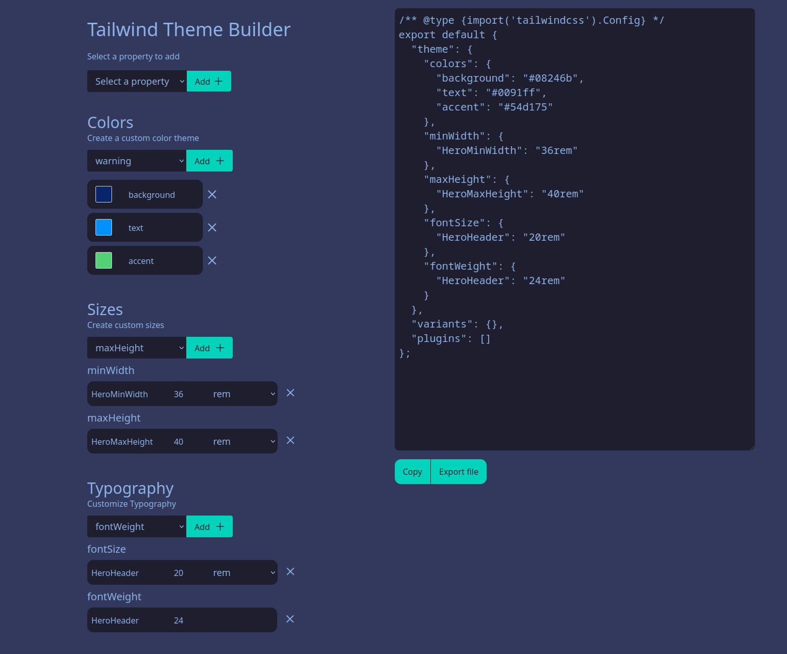

### WORK IN PROGRESS

# Tailwind Theme Builder

Tailwind Theme Builder is a user-interface webapp that enables you to create custom Tailwind CSS theme configurations effortlessly. With its intuitive UI, you can easily adjust settings like colors, typography, and sizes to suit your project's needs. Export your custom configuration and integrate it into your Tailwind CSS project.

## Coming Soon

1. **Preview Mode**: Visualize your custom theme changes in real-time as you adjust the settings.
2. **The Rest of the Tailwind Syntax**: Support for the complete set of Tailwind CSS properties and values.
3. **Auto Generation of Themes**: Generate multiple themes automatically based on your preferences.
4. **Additional Settings for Config**: Access more granular control over your configuration with advanced settings.
